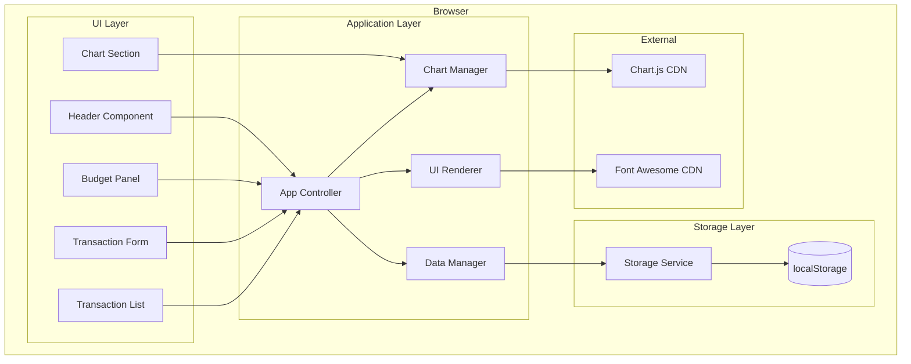
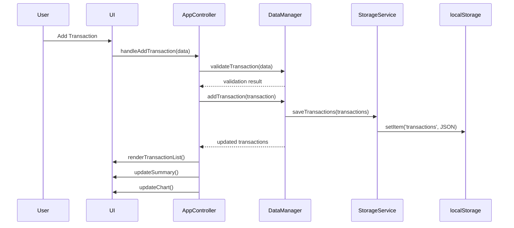

# Design Document

## Overview

BudgetPulse is a single-page personal finance tracker application built with vanilla HTML, CSS, and JavaScript. The application enables users to set monthly budgets, track income and expense transactions, view summary statistics, and visualize financial data through interactive charts. All data persists in the browser's localStorage, ensuring a seamless experience across sessions without requiring a backend server.

The architecture follows a modular pattern with clear separation between data management, UI rendering, and storage operations. The UI features a modern dark theme with accent colors, responsive layout using CSS Grid/Flexbox, and smooth interactions.

## Architecture



### Data Flow



## Components and Interfaces

### StorageService

Handles all localStorage operations with JSON serialization/deserialization.

```javascript
interface StorageService {
  // Transaction operations
  getTransactions(): Transaction[]
  saveTransactions(transactions: Transaction[]): void

  // Budget operations
  getBudgetLimit(monthKey: string): number
  saveBudgetLimit(monthKey: string, limit: number): void

  // Utility
  generateMonthKey(year: number, month: number): string
}
```

### DataManager

Manages application state and business logic.

```javascript
interface DataManager {
  // State
  transactions: Transaction[]
  budgetLimits: Map<string, number>
  selectedMonth: { year: number, month: number }

  // Transaction operations
  addTransaction(transaction: Transaction): Transaction
  deleteTransaction(id: string): boolean
  getTransactionsForMonth(year: number, month: number): Transaction[]

  // Budget operations
  setBudgetLimit(year: number, month: number, limit: number): void
  getBudgetLimit(year: number, month: number): number

  // Calculations
  calculateTotalIncome(transactions: Transaction[]): number
  calculateTotalExpenses(transactions: Transaction[]): number
  calculateRemainingBudget(budgetLimit: number, totalExpenses: number): number
  getBudgetStatus(budgetLimit: number, totalExpenses: number): 'within' | 'over'

  // Validation
  validateTransaction(data: TransactionInput): ValidationResult
}
```

### UIRenderer

Handles all DOM manipulation and UI updates.

```javascript
interface UIRenderer {
  // Rendering
  renderTransactionList(transactions: Transaction[]): void
  renderSummary(summary: SummaryData): void
  renderBudgetStatus(status: 'within' | 'over'): void

  // Form handling
  clearTransactionForm(): void
  showValidationError(field: string, message: string): void
  clearValidationErrors(): void

  // Month selector
  updateMonthSelector(year: number, month: number): void
}
```

### ChartManager

Manages Chart.js instance and chart updates.

```javascript
interface ChartManager {
  chart: Chart | null

  initializeChart(canvasElement: HTMLCanvasElement): void
  updateChart(income: number, expenses: number): void
  destroyChart(): void
}
```

### AppController

Orchestrates all components and handles user interactions.

```javascript
interface AppController {
  // Initialization
  init(): void
  loadSeedDataIfFirstRun(): void

  // Event handlers
  handleAddTransaction(event: Event): void
  handleDeleteTransaction(id: string): void
  handleMonthChange(year: number, month: number): void
  handleBudgetLimitChange(limit: number): void

  // Refresh operations
  refreshUI(): void
}
```

## Data Models

### Transaction

```javascript
interface Transaction {
  id: string           // Unique identifier (UUID or timestamp-based)
  date: string         // ISO date string (YYYY-MM-DD)
  description: string  // User-provided description
  amount: number       // Positive number representing the amount
  type: 'income' | 'expense'  // Transaction type
}
```

### TransactionInput

```javascript
interface TransactionInput {
  date: string
  description: string
  amount: string | number
  type: 'income' | 'expense'
}
```

### ValidationResult

```javascript
interface ValidationResult {
  isValid: boolean
  errors: {
    field: string
    message: string
  }[]
}
```

### SummaryData

```javascript
interface SummaryData {
  budgetLimit: number
  totalIncome: number
  totalExpenses: number
  remainingBudget: number
  status: 'within' | 'over'
}
```

### StorageSchema

```javascript
// localStorage keys and structure
{
  'budgetpulse_transactions': Transaction[]  // JSON array of all transactions
  'budgetpulse_budgets': {                   // JSON object mapping month keys to limits
    '2025-01': 5000,
    '2025-02': 4500,
    // ...
  }
}
```

## Correctness Properties

_A property is a characteristic or behavior that should hold true across all valid executions of a system-essentially, a formal statement about what the system should do. Properties serve as the bridge between human-readable specifications and machine-verifiable correctness guarantees._

### Property 1: Transaction Serialization Round Trip

_For any_ valid transaction object, serializing it to JSON and then deserializing should produce an equivalent transaction object with identical id, date, description, amount, and type values.

**Validates: Requirements 10.1, 10.2, 10.3**

### Property 2: Budget Limit Persistence Round Trip

_For any_ valid budget limit and month key, saving the budget limit to storage and then retrieving it should return the same numeric value.

**Validates: Requirements 1.1, 6.3**

### Property 3: Transaction Addition Increases Count

_For any_ valid transaction and existing transaction list, adding the transaction should result in the list length increasing by exactly one.

**Validates: Requirements 2.1**

### Property 4: Transaction Deletion Decreases Count

_For any_ existing transaction in the list, deleting it should result in the list length decreasing by exactly one and the deleted transaction no longer appearing in the list.

**Validates: Requirements 2.4**

### Property 5: Income Calculation Correctness

_For any_ list of transactions, the calculated total income should equal the sum of amounts for all transactions where type equals 'income'.

**Validates: Requirements 4.1**

### Property 6: Expense Calculation Correctness

_For any_ list of transactions, the calculated total expenses should equal the sum of amounts for all transactions where type equals 'expense'.

**Validates: Requirements 4.2**

### Property 7: Remaining Budget Calculation

_For any_ budget limit and total expenses value, the remaining budget should equal the budget limit minus total expenses.

**Validates: Requirements 4.3**

### Property 8: Budget Status Determination

_For any_ budget limit and total expenses, the status should be 'within' if and only if total expenses is less than or equal to budget limit, and 'over' otherwise.

**Validates: Requirements 4.4, 4.5**

### Property 9: Month Filtering Correctness

_For any_ list of transactions and selected month/year, the filtered result should contain only transactions whose date falls within that month and year, and should contain all such transactions.

**Validates: Requirements 3.1**

### Property 10: Transaction Validation Rejects Invalid Input

_For any_ transaction input with empty description, non-positive amount, or missing required fields, validation should return isValid as false with appropriate error messages.

**Validates: Requirements 2.2, 2.3**

## Error Handling

### Input Validation Errors

- **Empty Description**: Display inline error "Description is required"
- **Invalid Amount**: Display inline error "Amount must be a positive number"
- **Missing Date**: Display inline error "Date is required"
- **Missing Type**: Display inline error "Please select income or expense"

### Storage Errors

- **localStorage Unavailable**: Display a warning banner indicating data will not persist
- **Corrupted Data**: Reset to empty state and log error to console
- **Storage Quota Exceeded**: Display error message suggesting user delete old transactions

### Chart Errors

- **Chart.js Load Failure**: Display fallback text showing income/expense totals without visualization
- **Canvas Not Supported**: Display fallback text-based summary

## Testing Strategy

### Unit Testing

Unit tests will verify individual functions in isolation:

- **DataManager Tests**

  - `validateTransaction()` with various valid and invalid inputs
  - `calculateTotalIncome()` with empty, single, and multiple transactions
  - `calculateTotalExpenses()` with mixed transaction types
  - `calculateRemainingBudget()` with positive and negative results
  - `getBudgetStatus()` boundary conditions

- **StorageService Tests**
  - `generateMonthKey()` format correctness
  - Mock localStorage for save/load operations

### Property-Based Testing

Property-based tests will use **fast-check** library (loaded via CDN) to verify universal properties across randomly generated inputs.

**Configuration**: Each property test will run a minimum of 100 iterations.

**Test File Structure**:

```
tests/
  properties.test.html  - Browser-runnable property tests
```

**Properties to Test**:

1. **Transaction Round Trip** (Property 1)

   - Generate random valid transactions
   - Serialize to JSON, deserialize back
   - Assert equality of all fields

2. **Budget Persistence Round Trip** (Property 2)

   - Generate random month keys and budget values
   - Save and retrieve
   - Assert value equality

3. **Transaction Count Invariants** (Properties 3, 4)

   - Generate random transaction lists
   - Add/delete operations
   - Assert count changes correctly

4. **Calculation Properties** (Properties 5, 6, 7, 8)

   - Generate random transaction lists with known totals
   - Assert calculations match expected values

5. **Filtering Property** (Property 9)

   - Generate transactions across multiple months
   - Filter by specific month
   - Assert all results are in correct month and no valid transactions are excluded

6. **Validation Property** (Property 10)
   - Generate invalid inputs (empty strings, negative numbers, missing fields)
   - Assert validation rejects them

**Test Annotation Format**:
Each property test will include a comment in this format:

```javascript
// **Feature: budget-tracker, Property 1: Transaction Serialization Round Trip**
```

### Integration Testing

Manual integration tests to verify:

- Full add transaction flow updates all UI components
- Delete transaction updates list, summary, and chart
- Month change filters transactions and updates displays
- Budget limit change persists and updates status
- Page reload restores all data correctly

### Browser Compatibility

Test in:

- Chrome (latest)
- Firefox (latest)
- Safari (latest)
- Edge (latest)
